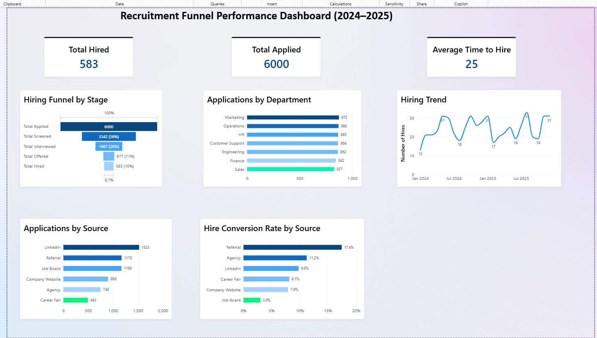

# Recruitment Funnel Analysis (SQL + Power BI)

## Business Question

Where are candidates dropping off in the hiring process, and which departments or sourcing channels need attention?

## Dashboard

Interactive Power BI dashboard analyzing the recruitment funnel from application to hire.

### Dashboard Visuals

- Hiring Funnel by Stage
- Hiring Trend
- Applications by Source
- Applications by Department
- Hire Conversion Rate by Source

## Dataset

`recruitment_funnel.csv` contains **6,000 synthetic candidate records** covering January 2024 to December 2025.

The data tracks candidates through five stages:

**Applied → Screened → Interviewed → Offered → Hired**

The dataset includes **7 departments, 20 roles, and 6 sourcing channels**.

## Key Findings

- **Screening conversion:** **56%** of applicants progressed to the screening stage.
- **Interview conversion:** **28%** of applicants progressed to the interview stage.
- **Overall funnel:** **583 candidates were hired** from 6,000 applicants, an overall applied-to-hire rate of **9.7%**.
- **Source effectiveness:** Referrals had a **17.4%** hire conversion rate compared with **3.0%** for Job Board candidates.
- **Offer declines:** Engineering had an **offer-decline rate of 16.7%**, identified through the SQL analysis.
- **Time to hire:** Average time-to-hire was **25 days**, with Screened → Interviewed taking the longest at **9 days** on average.

## Recommendations

- Investigate the Engineering screening process to understand the higher candidate drop-off.
- Evaluate greater focus on referral sourcing given its higher hire conversion rate.
- Review the Engineering offer process and reasons for offer declines.
- Investigate delays between screening and interviews to improve hiring speed.

## Project Files

- `recruitment_funnel.csv` — dataset
- `recruitment_funnel.db` — SQLite database
- `analysis_queries.sql` — SQL analysis queries
- `generate_data.py` — data generation script
- `dasboard.png.png` — Power BI dashboard

## Tools Used

**SQL (SQLite) · Power BI · Python · DAX · GitHub**

